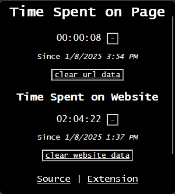

# TrackPageTime



## What it does

Locally tracks time spent in specific urls along with overall time in websites.

## What it shows

Total time spent in specific URLs and current website.
```

This will display the `example.png` image from the same directory as your README file.
